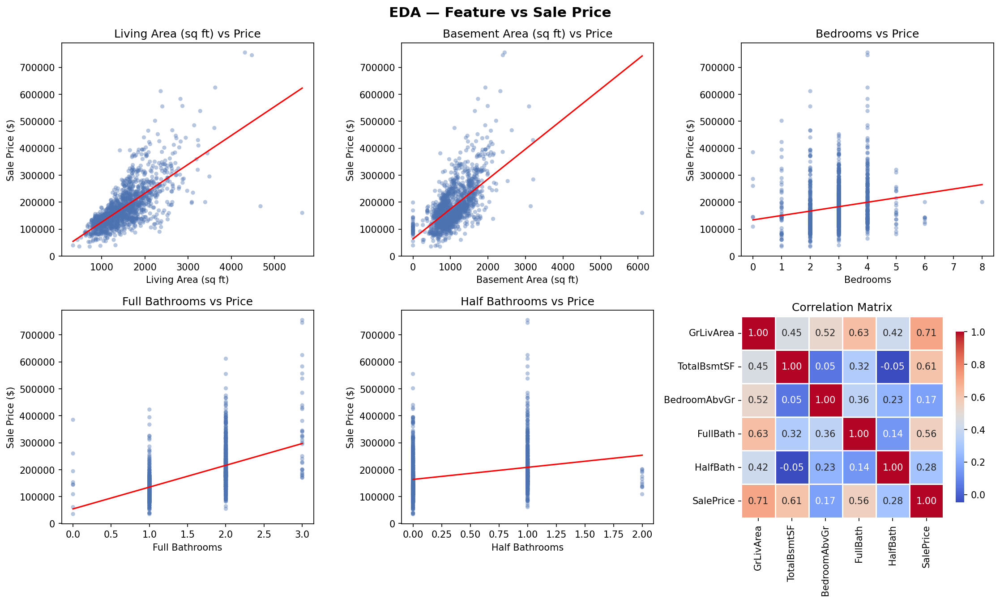
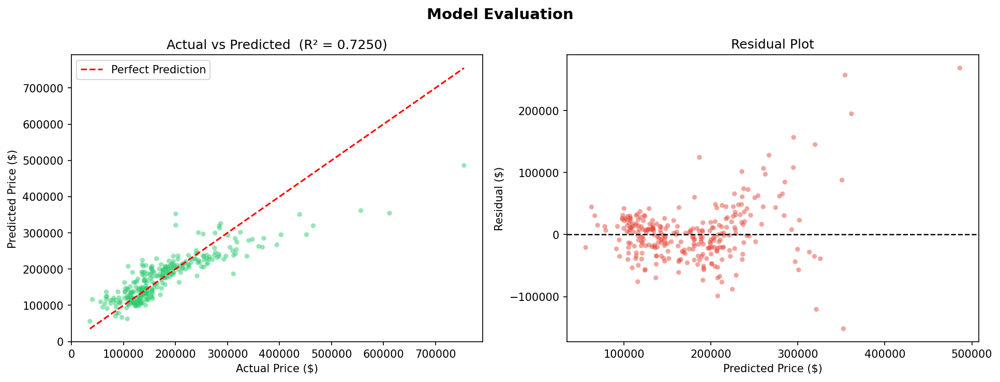

<div align="center">

# 🏡 House Price Prediction using Linear Regression

### SkillCraft Technology Internship
### Machine Learning Track — Task 01

Predicting house sale prices using Machine Learning 🚀


</div>


# 📌 Project Overview

This project implements a **Linear Regression Model** to predict house sale prices using selected housing features from the Kaggle House Prices dataset.

The model learns relationships between house characteristics and their selling prices to generate accurate predictions for unseen houses.


# 🎯 Objective

Build a Machine Learning model that predicts house prices using:

- 📏 Living Area (`GrLivArea`)
- 🏠 Basement Area (`TotalBsmtSF`)
- 🛏️ Bedrooms (`BedroomAbvGr`)
- 🚿 Full Bathrooms (`FullBath`)
- 🚽 Half Bathrooms (`HalfBath`)


# 📂 Dataset

**Source:** House Prices – Advanced Regression Techniques (Kaggle)

The dataset contains detailed information about residential homes.

| File | Description |
|------|-------------|
| train.csv | Training dataset containing 1460 records |
| test.csv | Testing dataset containing 1459 records |
| sample_submission.csv | Submission format |
| data_description.txt | Detailed feature descriptions |

🔗 Dataset Link:

https://www.kaggle.com/competitions/house-prices-advanced-regression-techniques

---

# 🔍 Features Used

| Feature | Description |
|----------|------------|
| GrLivArea | Above-ground living area (sq ft) |
| TotalBsmtSF | Total basement area (sq ft) |
| BedroomAbvGr | Number of bedrooms |
| FullBath | Number of full bathrooms |
| HalfBath | Number of half bathrooms |

---

# 🛠️ Technologies Used

- Python
- Pandas
- NumPy
- Matplotlib
- Seaborn
- Scikit-Learn

---

# ⚙️ Machine Learning Workflow

### 1️⃣ Data Collection
Load and inspect the housing dataset.

### 2️⃣ Data Preprocessing
- Handle missing values
- Select important features
- Prepare training data

### 3️⃣ Exploratory Data Analysis (EDA)
- Feature relationships
- Correlation analysis
- Scatter plots

### 4️⃣ Model Training
Train a Linear Regression model using Scikit-Learn.

### 5️⃣ Model Evaluation
Evaluate performance using:
- R² Score
- MAE
- RMSE

### 6️⃣ Prediction
Generate house price predictions for unseen data.

---

# 🚀 How to Run

### Clone Repository

```bash
git clone https://github.com/YOUR_USERNAME/SCT_ML_01.git
cd SCT_ML_01
```

### Install Dependencies

```bash
pip install pandas numpy matplotlib seaborn scikit-learn
```

### Run the Project

```bash
python house_price_prediction.py
```

---

# 📊 Model Performance

| Metric | Value |
|---------|---------|
| R² Score | 0.725 |
| MAE | $30,693 |
| RMSE | $45,929 |

✅ The model explains approximately **72.5%** of the variance in house prices.

---

# 📈 Output Files

| File | Description |
|---------|---------|
| eda_plots.png | Exploratory Data Analysis visualizations |
| model_evaluation.png | Model evaluation plots |
| submission.csv | Predicted house prices |

---

# 📷 Project Results

## Exploratory Data Analysis



## Model Evaluation



---

# 📁 Project Structure

```text
SCT_ML_01/
│
├── house_price_prediction.py
├── train.csv
├── test.csv
├── sample_submission.csv
├── data_description.txt
├── eda_plots.png
├── model_evaluation.png
├── submission.csv
└── README.md
```

---

# 🎓 Skills Gained

✔ Data Preprocessing

✔ Exploratory Data Analysis

✔ Feature Selection

✔ Linear Regression

✔ Model Evaluation

✔ Machine Learning Workflow

---

# 👨‍💻 Internship Details

**Organization:** SkillCraft Technology

**Domain:** Machine Learning

**Task:** 01 of 04

**Project:** House Price Prediction using Linear Regression

---

<div align="center">


</div>
